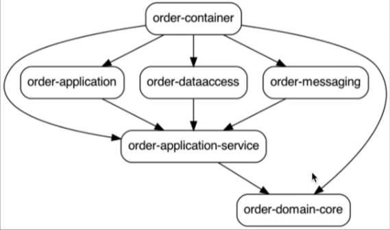

# Food Ordering System

## Project Structure

### Common

* **common-domain**
  * Common model domain definitions between bounded contexts

### Infrastructure

* **kafka**
  * kafka-config-data
    * Config data classes with properties for consumer/producer init
  * kafka-consumer
    * Generic consumer
  * kafka-producer
    * Generic producer
  * kafka-model
    * Avro model definition and classes generation using Avro maven plugin

### Order Service

- **order-domain**
    - order-application-service:
        - Port definitions. Input port implementations (primary adapters)
        - Business logic
        - DTO and mappers
    - order-domain-core: Domain model
- **order-application**: Primary adapter for requests into the domain layer (API Rest)
- **order-dataaccess**: Secondary adapter for data access
- **order-messaging**: Secondary adapter for messaging output (KAFKA)
- **order-container**: Spring boot project and jar to run the Order microservice

#

