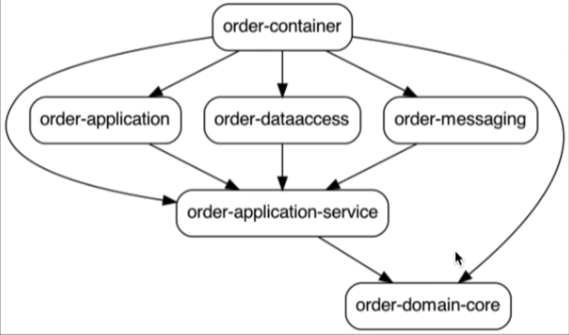

# Order Service

## Structure

- order-domain
  - order-application-service: 
    - Port definitions 
    - Business logic
    - DTO and mappers
  - order-domain-core: Domain model
- order-application: Primary adapter for requests into the domain layer (API Rest)
- order-dataaccess: Secondary adapter for data access
- order-messaging: Secondary adapter for messaging output (KAFKA)
- order-container: Spring boot project and jar to run the Order microservice